# Linting, Testing, and CI/CD Implementation Summary

## Overview

This document summarizes the infrastructure added to ensure code consistency and prevent broken code from being merged.

## What Was Implemented

### 1. ESLint Configuration ✅

**Files Created:**
- `eslint.config.js` - Modern ESLint 9 flat config format

**Features:**
- TypeScript support with `@typescript-eslint/parser` and `@typescript-eslint/eslint-plugin`
- Vue.js 3 support with `eslint-plugin-vue`
- **Strict no-console rule** - Prevents direct `console.*` usage (except in logger.ts)
- Browser globals configured for frontend packages
- Smart ignores for build artifacts and config files

**Usage:**
```bash
npm run lint           # Check for issues
npm run lint:fix       # Auto-fix issues
```

### 2. Testing Infrastructure ✅

**Files Created:**
- `vitest.config.ts` - Vitest configuration
- `packages/shared/src/utils/logger.test.ts` - Logger utility tests (12 tests)
- `tests/code-standards.test.ts` - Code standards validation tests (2 tests)

**Features:**
- Vitest test framework with globals and coverage support
- Comprehensive logger utility tests (100% coverage)
- Automated code standards enforcement:
  - Scans for console.* usage violations
  - Validates logger imports

**Usage:**
```bash
npm run test           # Run all tests
npm run test:watch     # Watch mode
npm run test:ui        # Interactive UI
npm run test:coverage  # Generate coverage report
```

**Test Results:**
- ✅ 14/14 tests passing
- ✅ 0 console.* violations
- ✅ All code standards enforced

### 3. Code Fixes ✅

**Fixed Files:**
- `packages/backend/src/index.ts` - Replaced 3 console.log with logger.custom
- `packages/backend/src/routes/auth.ts` - Replaced 3 console.error with logger.error
- `packages/backend/src/websocket/socketServer.ts` - Replaced 5 console calls with logger

**Total Violations Fixed:** 11

### 4. CI/CD Pipeline ✅

**File Created:**
- `.github/workflows/ci.yml`

**Features:**
- **Triggers:** Runs on PRs and pushes to main/develop
- **Jobs:**
  1. **lint-and-test**: Runs ESLint and tests on Node 18 and 20
  2. **type-check**: TypeScript compilation checks for all packages
  3. **status-check**: Validates all checks passed
- **Security:** Proper GITHUB_TOKEN permissions (CodeQL approved)
- **Coverage:** Optional Codecov integration

**Checks Performed:**
- ✅ ESLint validation
- ✅ Unit tests
- ✅ TypeScript type checking
- ✅ Code standards validation

### 5. Documentation ✅

**Files Created/Updated:**
- `.github/copilot-instructions.md` - Detailed Copilot coding guidelines
- `CONTRIBUTING.md` - Updated with logging standards and testing info
- `README.md` - Added code quality section

**Guidelines Documented:**
- Logger usage (instead of console.*)
- Available logger methods and examples
- Pre-commit checklist
- CI/CD process
- Code quality standards

## How It Works

### Logger Enforcement

The logger utility (`@yektayar/shared`) provides consistent, formatted logging:

```typescript
import { logger } from '@yektayar/shared'

// Available methods
logger.success('Operation successful')
logger.error('Error occurred', error)
logger.info('Information')
logger.warn('Warning')
logger.debug('Debug info')
logger.custom('🚀', 'Custom message', 'cyan')
```

**Benefits:**
- Colorized output with emojis
- Works in browser and Node.js
- Better visibility and searchability
- Consistent formatting

### Enforcement Layers

1. **ESLint** - Catches console.* during development
2. **Tests** - Automated scan prevents commits with violations
3. **CI/CD** - Blocks PRs that fail linting or tests
4. **Documentation** - Guides developers on correct usage

## Project Scripts

All scripts are available from the root:

```bash
# Linting
npm run lint              # Check all packages
npm run lint:fix          # Auto-fix issues

# Testing
npm run test              # Run all tests
npm run test:watch        # Watch mode
npm run test:ui           # Interactive UI
npm run test:coverage     # Coverage report

# Building
npm run build             # Build all packages
npm run build:backend     # Build backend only
npm run build:admin       # Build admin panel only
npm run build:mobile      # Build mobile app only
```

## CI/CD Workflow

```mermaid
graph TD
    A[Push/PR] --> B[CI Triggered]
    B --> C[Lint & Test Job]
    B --> D[Type Check Job]
    C --> E{Pass?}
    D --> F{Pass?}
    E -->|Yes| G[Status Check]
    F -->|Yes| G
    E -->|No| H[Block Merge ❌]
    F -->|No| H
    G --> I{All Pass?}
    I -->|Yes| J[Allow Merge ✅]
    I -->|No| H
```



## Developer Workflow

### Before Committing

1. Write/modify code using logger instead of console.*
2. Run tests: `npm run test`
3. Run linter: `npm run lint`
4. Fix any issues: `npm run lint:fix`
5. Commit changes

### During PR

1. CI automatically runs on push
2. All checks must pass:
   - ✅ ESLint validation
   - ✅ Unit tests
   - ✅ Type checking
3. Review feedback and update if needed
4. Once approved and checks pass, merge

## Security

- ✅ CodeQL scans show 0 vulnerabilities
- ✅ Proper GITHUB_TOKEN permissions in workflows
- ✅ No secrets or sensitive data in code

## Next Steps

Suggested improvements:
- Add more unit tests for business logic
- Consider adding E2E tests with Playwright
- Set up test coverage thresholds
- Add pre-commit hooks (husky + lint-staged)
- Configure Dependabot for security updates

## Resources

- **ESLint Config**: `eslint.config.js`
- **Vitest Config**: `vitest.config.ts`
- **CI Workflow**: `.github/workflows/ci.yml`
- **Copilot Instructions**: `.github/copilot-instructions.md`
- **Logger Implementation**: `packages/shared/src/utils/logger.ts`
- **Logger Tests**: `packages/shared/src/utils/logger.test.ts`
- **Code Standards Tests**: `tests/code-standards.test.ts`

---

**Status:** ✅ Complete and Operational
**Last Updated:** 2025-11-12
